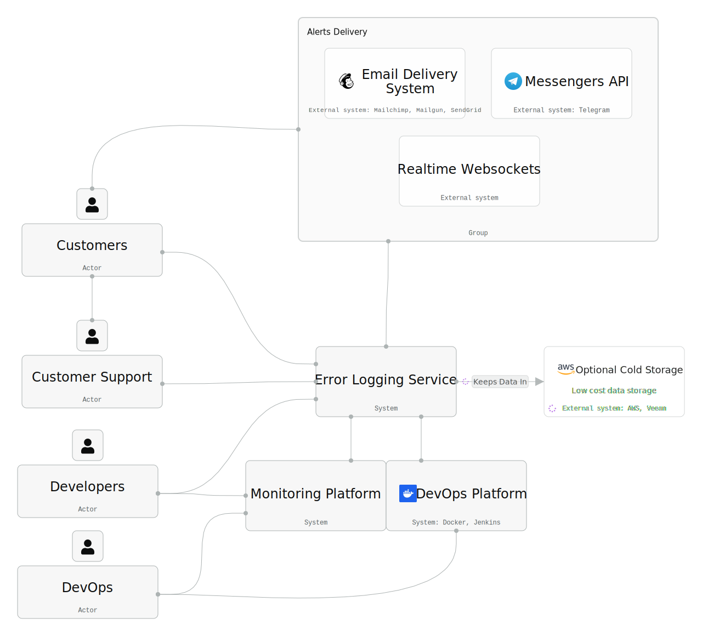
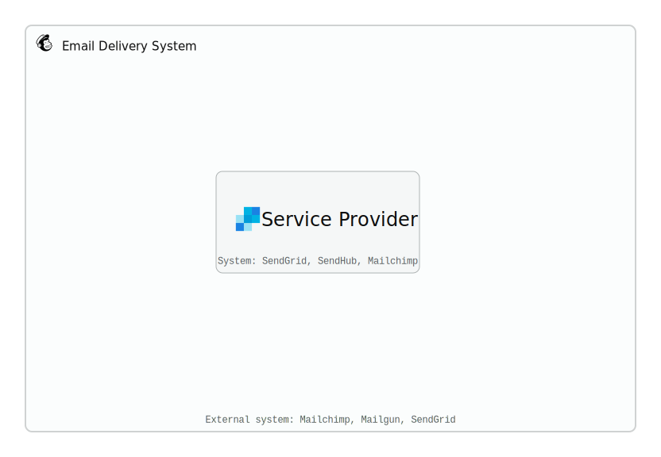
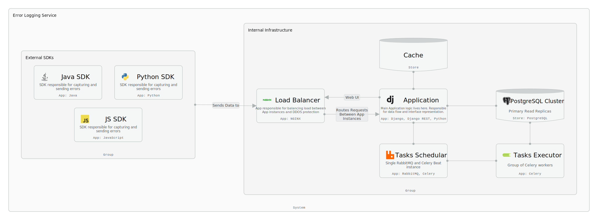
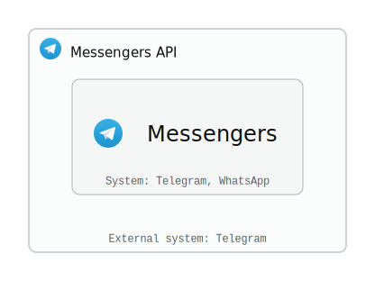
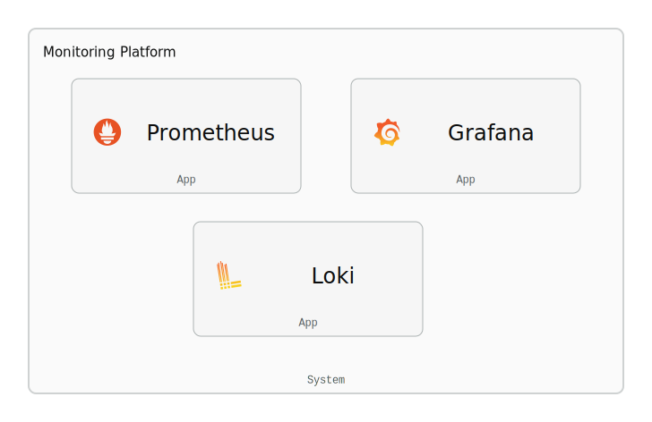
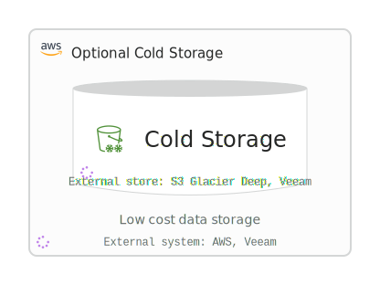
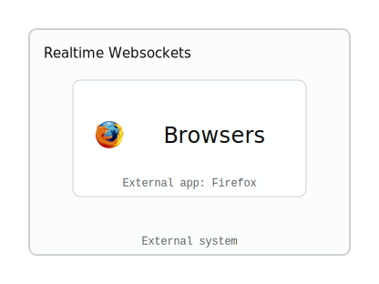
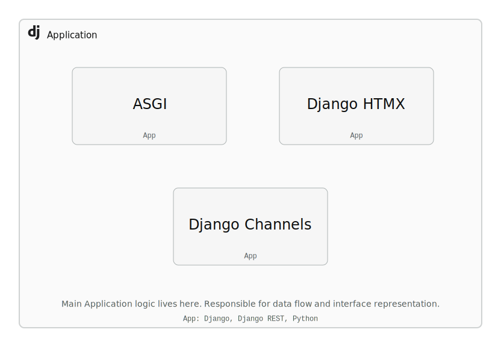

# System Architecture (C4 Model)

C4-model architecture (Context, App, Component levels) for an error logging and monitoring platform, exported from IcePanel. The stack is Django, Celery, PostgreSQL, NGINX, with multi-language SDKs for error capture, Django Channels for real-time browser notifications, Prometheus/Loki/Grafana for monitoring, and email + messenger APIs for alerts. Four actor types, nine systems, fourteen apps, three data stores.

---

## 1. Context Diagram

Actors on the left (Customers, Developers, DevOps, Customer Support), internal systems in the center (Error Logging, DevOps Platform, Monitoring), external integrations on the right (Email, Messengers, Websockets, Cold Storage). The Alerts Delivery group bundles the three notification channels.

---

## 2. App Diagrams

### 2.1. Email Delivery System

External system that handles email delivery. Multiple providers for redundancy.

**Technologies:** Mailchimp, Mailgun, SendGrid, SendHub

---

### 2.2. Error Logging Application

The core system. SDKs (Python, JS, Java) capture errors and send them through NGINX to the Django + DRF application. RabbitMQ + Celery Beat schedules async work for Celery workers. PostgreSQL Cluster stores everything, with a cache layer in front and optional Cold Storage for archival.

**Internal Infrastructure:** Application, Load Balancer, Tasks Executor, Tasks Scheduler, Cache, PostgreSQL Cluster

**External SDKs:** Python SDK, JS SDK, Java SDK (hosted on GitHub)

---

### 2.3. Messengers API

Sends alerts through messaging platforms.

**Technologies:** Telegram, WhatsApp API

---

### 2.4. Monitoring Platform

Observability stack. Prometheus collects metrics, Loki aggregates logs, Grafana visualizes both.

**Apps:** Prometheus (metrics), Loki (logs), Grafana (visualization)

---

### 2.5. Optional Cold Storage

Planned archival storage for old error logs.

**Status:** Future

**Technologies:** AWS S3 Glacier Deep Archive, Veeam

**Deployment:** Public cloud (AWS)

---

### 2.6. Realtime Websockets

Pushes real-time alerts to browsers via websockets.

**App:** Browsers (Firefox)

---

## 3. Component Diagram

### 3.1. Application

The main monolith. Handles data flow and serves the UI. Deployed as a shared app across several instances.

**Technologies:** Django, Django REST, Python

**Components:** Django + HTMX (frontend), Django Channels (websockets), ASGI (async server)

---

## 4. Actors

| Actor | Type | Description |
|-------|------|-------------|
| **Customers** | Internal | End users of the platform |
| **Developers** | Internal | Integrate SDKs, consume error data |
| **DevOps** | Internal | Manage infrastructure and deployments |
| **Customer Support** | Internal | Handle user issues |

---

## 5. Systems

| System | Type | Technologies | Deployment | Cost |
|--------|------|-------------|------------|------|
| **Error Logging Service** | Internal | Django, Celery, PostgreSQL | -- | -- |
| **DevOps Platform** | Internal | Docker, Jenkins | Private cloud | Free |
| **Monitoring Platform** | Internal | Prometheus, Loki, Grafana | -- | -- |
| **Service Provider** | Internal | SendGrid, SendHub, Mailchimp, Mailgun | On Prem | Low |
| **Email Delivery System** | External | Mailchimp, Mailgun, SendGrid, SendHub | -- | Low |
| **Messengers API** | External | Telegram | -- | -- |
| **Messengers** | Internal | Telegram, WhatsApp API | -- | -- |
| **Realtime Websockets** | External | -- | -- | -- |
| **Optional Cold Storage** | External | AWS, Veeam | Public cloud | Low |

---

## 6. Apps

| App | Type | Technologies | Purpose |
|-----|------|-------------|---------|
| **Application** | Internal | Django, Django REST, Python | Main monolith -- data flow and interface |
| **Load Balancer** | Internal | NGINX | Traffic distribution and DDoS protection |
| **Tasks Executor** | Internal | Celery | Group of Celery workers |
| **Tasks Scheduler** | Internal | RabbitMQ, Celery | Single RabbitMQ + Celery Beat instance |
| **Django + HTMX** | Internal | -- | Frontend rendering |
| **Django Channels** | Internal | -- | Websocket support |
| **ASGI** | Internal | -- | Async server gateway |
| **Prometheus** | Internal | Prometheus | Metrics collection |
| **Loki** | Internal | Grafana Loki | Log aggregation |
| **Grafana** | Internal | Grafana | Dashboards and visualization |
| **Python SDK** | Internal | Python | Error capture SDK (GitHub) |
| **JS SDK** | Internal | JavaScript | Error capture SDK (GitHub) |
| **Java SDK** | Internal | Java | Error capture SDK (GitHub) |
| **Browsers** | External | Firefox | Real-time alert consumers |

---

## 7. Stores

| Store | Type | Technologies | Deployment | Purpose |
|-------|------|-------------|------------|---------|
| **PostgreSQL Cluster** | Internal | PostgreSQL | Private cloud | Primary + Read Replicas |
| **Cache** | Internal | -- | -- | Application caching layer |
| **Cold Storage** | External | S3 Glacier Deep Archive, Veeam | On Prem (AWS) | Low-cost archival (future) |
